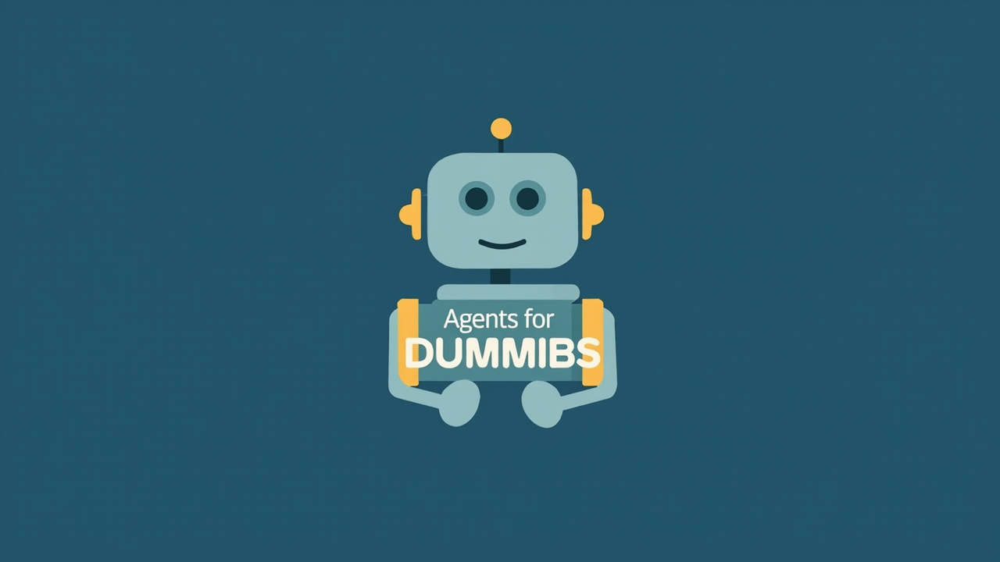

# Agents for Dummies 🦞

> The friendly guide to OpenClaw and AI agents — beginner to intermediate. Built for humans, not engineers. Dark theme, lobster energy.



**Live site:** [agentsfordummies.vercel.app](https://agentsfordummies.vercel.app)
**Repo:** [github.com/tylerdotai/agentsfordummies](https://github.com/tylerdotai/agentsfordummies)

---

## What Is This?

A scroll-triggered, animated guide that takes someone who's only used ChatGPT through the browser and gets them:

1. **Understanding** what AI agents are and why they matter
2. **Getting started** with OpenClaw, Hermes Agent, or KiloClaw (all free)
3. **Applying it** with real beginner → intermediate use cases they can try today
4. **Going deeper** via the best YouTube creators and X accounts to follow

The site is opinionated: dark OpenClaw aesthetic, non-technical tone, encouraging voice, zero jargon without explanation.

---

## Design

See [DESIGN.md](./DESIGN.md) for the full design system.

**Quick facts:**
- **Palette:** Dark (`#0a0a0a` bg) + Orange accent (`#ff3d00`)
- **Typography:** Inter (headings/UI) + JetBrains Mono (code)
- **Animations:** GSAP + ScrollTrigger — clip-path reveals, staggered entrances, active nav pill, counter animations
- **Icons:** Lucide React
- **Design goal:** Encouraging and empowering — never intimidating

---

## Tech Stack

| Layer | Choice |
|-------|--------|
| Framework | Next.js 16 (App Router) |
| Language | TypeScript |
| Styling | Tailwind CSS v4 |
| Animations | GSAP + ScrollTrigger |
| Micro-interactions | Framer Motion |
| Deployment | Vercel |
| Icons | Lucide React |

---

## Getting Started

```bash
git clone https://github.com/tylerdotai/agentsfordummies.git
cd agentsfordummies
npm install
npm run dev
```

**Build checks:**
```bash
npm run build      # Production build succeeds
npm run typecheck  # TypeScript compiles without errors
npm run lint       # ESLint passes (0 errors)
```

---

## Project Structure

```
agentsfordummies/
├── src/
│   ├── app/
│   │   ├── layout.tsx       # Root layout (fonts, navbar, footer, meta)
│   │   └── page.tsx         # Single-page scroll experience
│   ├── components/
│   │   ├── Navbar.tsx           # OpenAI-style overlay nav + desktop pill nav
│   │   ├── Navbar.module.css
│   │   ├── ScrollProgress.tsx   # Top scroll progress bar
│   │   ├── Footer.tsx            # Social icons footer
│   │   ├── HeroSection.tsx       # Hero — pin, scrub, clip-path reveal
│   │   ├── WhatIsSection.tsx      # 4-card what is an AI agent
│   │   ├── WhyCareSection.tsx     # Stats + alternating slide-in rows
│   │   ├── SetupCloudSection.tsx  # OpenClaw, Hermes Agent, KiloClaw cards
│   │   ├── UseCasesSection.tsx    # Beginner + Intermediate use cases
│   │   ├── ResourcesSection.tsx   # MiniMax, YouTube, X, Docs
│   │   └── useActiveSection.ts    # GSAP section tracking hook
│   ├── styles/
│   │   └── globals.css           # Tailwind + CSS custom properties
│   └── lib/
│       └── utils.ts
├── public/
│   ├── favicon.svg
│   └── og-image.png
├── .gitignore
├── package.json
├── tsconfig.json
├── next.config.ts
├── eslint.config.mjs
├── prettier.config.mjs
├── DESIGN.md
└── README.md
```

---

## What's Covered

### Agents (all free to use)

- **OpenClaw 🦞** — open-source, runs locally, connects to Discord/Telegram/WhatsApp/Signal/iMessage/Slack
- **Hermes Agent** — by NousResearch, zero vendor lock-in, runs on any model, $5 VPS capable
- **KiloClaw** — managed path, no terminal required, fastest way to get started

### Use Cases (beginner → intermediate)

Real prompts you can copy and paste into your agent right now:
- Email triage and drafting
- Meeting scheduling hands-free
- Research without the rabbit hole
- Community management
- Scheduled monitoring workflows
- Content iteration

### Resources

- **YouTube:** Alex Finn (@AlexFinnOfficial), Matthew Berman (@matthew_berman)
- **X Accounts:** @steipete (OpenClaw creator), @NousResearch, @karpathy, @digitalix, @tom_doerr, @kloss_xyz, @AlexFinnOfficial, @matthewberman, @openclaw community
- **AI Provider:** MiniMax (Tyler's recommendation — 10% off referral link in Resources)

---

## Author

**Tyler Delano** — [@tylerdotai](https://x.com/tylerdotai) · [GitHub](https://github.com/tylerdotai) · [LinkedIn](https://linkedin.com/in/tylerpdelano) · [flumeusa.com](https://flumeusa.com)

Built with 🦞 by Tyler + AI agents.
